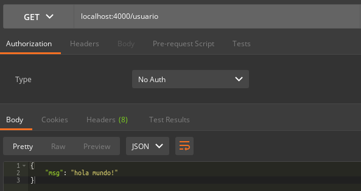
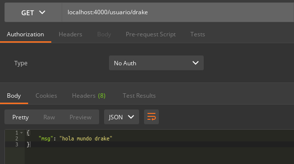
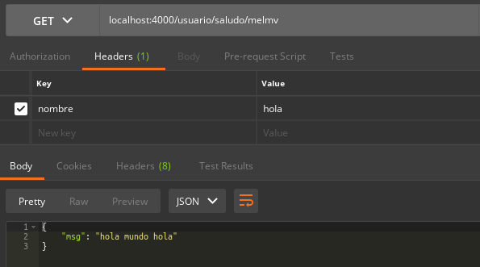
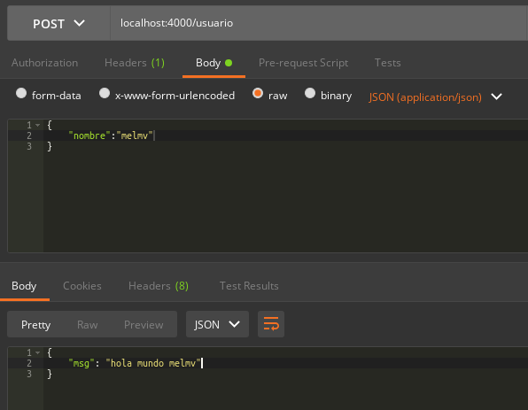

# API-REST - TypeScript
## *Indice*

* [Requisitos](#requisitos)
* [Librerias usadas](#librerias-usadas)
* [Comando](#comandos)
* [Endpoints](#endpoints)
    * [1. GET](#get)
    * [2. POST](#post)


## **Requisitos**
- [NPM](https://www.npmjs.com/)
- [NODEMON](https://www.npmjs.com/package/nodemon)
- [TS](https://www.typescriptlang.org/download) 

## **Librerias usadas**
- [Express](https://www.npmjs.com/package/morgan): servidor HTTP.
- [Morgan](https://www.npmjs.com/package/express): Por medio de "dev" muestra de una forma visual, el estado de las respuestas que se estan 
servidor.
- [Cors](https://www.npmjs.com/package/cors): Cabeceras http que permite a los servidores indicar a los navegadores si deben permitir la carga de recursos para un origen distinto al suyo.


## **Comandos** 
```
npm install 
npm run build
npm run dev
```

## **Endpoints**
### GET
- Retorna un json 
<p align="center">
  
</p>

- Retorna un json con el nombre ingresado como "parametro"
<p align="center">
  
</p>

- Retorna un json con el nombre ingresado como "headers"
<p align="center">
  
</p>


### POST

- Retorna un json 
<p align="center">
  
</p>